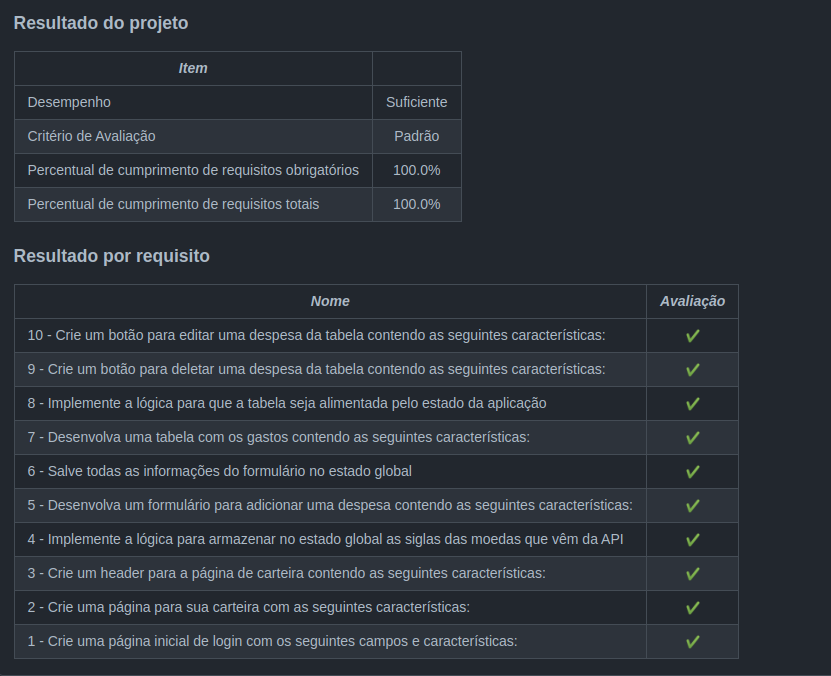

<h1>Sobre</h1>

Sexto projeto do módulo 2 - Front-end, da <a href="https://betrybe.com" target="_blank">Trybe!</a>

O desafio foi criar uma carteira de simulação de gastos com conversão automática da moeda escolhida para real.

Na aplicação é possível adicionar, editar e excluir gastos e, a cada modificação, o valor total é atualizado.

obs: As imagens dos planetas e as informações das missões são fornecidas no projeto.

<h1>Instalando</h1>

Para instalar, basta executar o comando <code>npm install</code> no diretório raiz do projeto.

Logo depois execute o comando <code>npm start</code>

<h1>Tecnologias utilizadas</h1>

<ul>
  <li>React</li>
  <li>React Router</li>
  <li>Redux</li>
  <li>CSS</li>
</ul>

<h1>Nota</h1>
